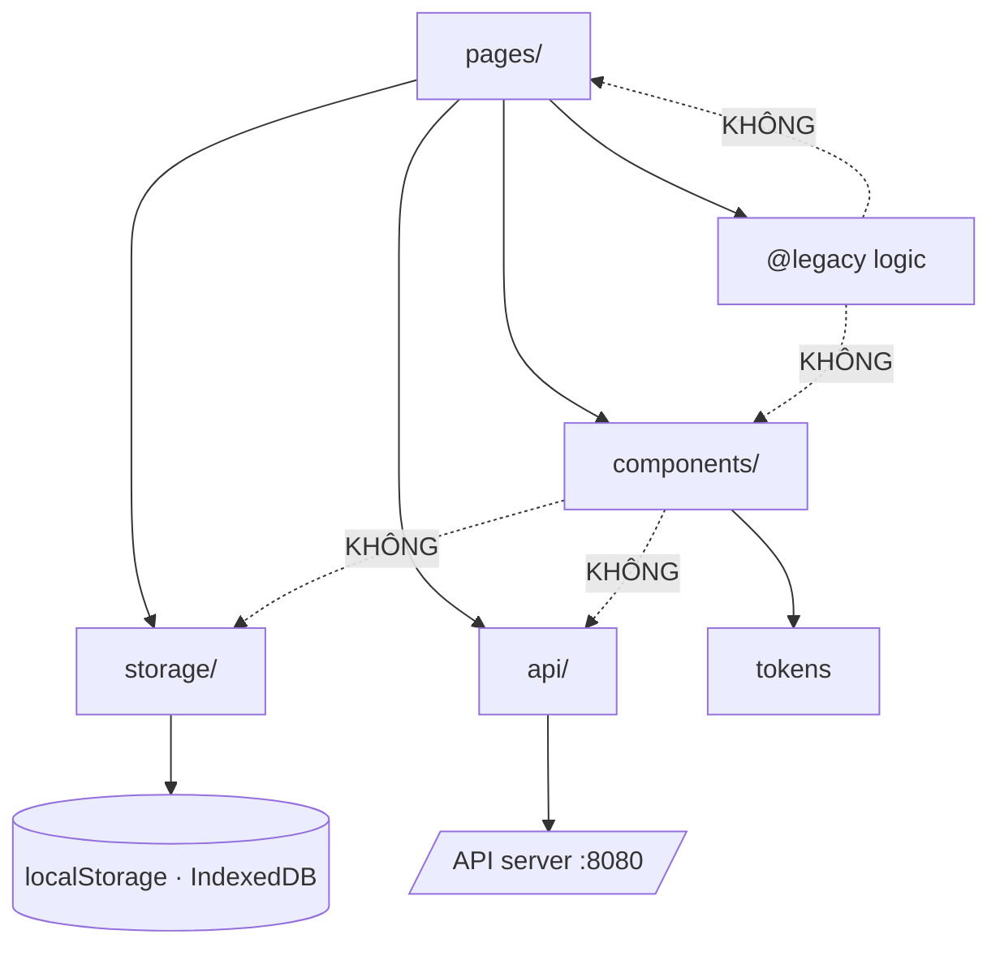
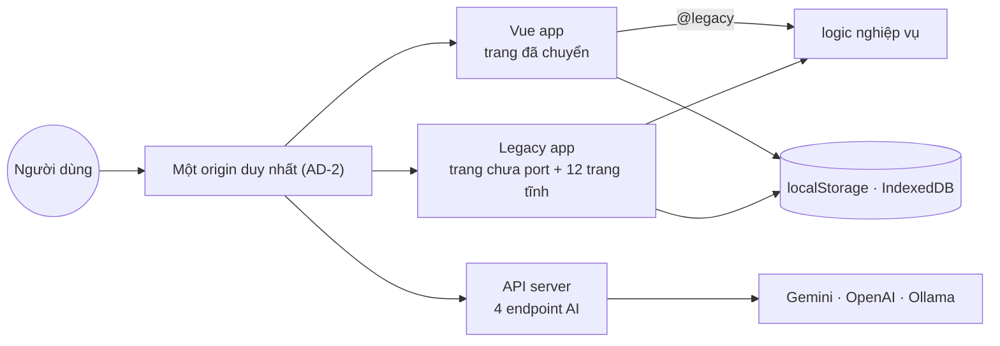

# Architecture Spine — SkillForge port sang Vue 3 + Vite

## Design Paradigm

**Strangler fig façade trên client phân lớp một chiều.** Vue app là façade mọc dần quanh Legacy app; mỗi trang được port là một nhánh chuyển sang façade, phần chưa port vẫn do Legacy phục vụ. Không có ngày nào cả hai cùng nắm một trang.

Bốn lớp, phụ thuộc chảy **một chiều xuống dưới**:

| Lớp | Ở đâu | Được phụ thuộc vào |
|---|---|---|
| Pages | `web-app/src/pages/` | components, logic, adapters, api |
| Components dùng chung | `web-app/src/components/` | chỉ tokens |
| Logic nghiệp vụ | `web-en/js/features/**` qua alias `@legacy` | không gì thuộc Vue |
| Adapters (storage, api) | `web-app/src/storage/`, `web-app/src/api/` | không gì thuộc Vue |



## Invariants & Rules

### AD-1 — Phụ thuộc chảy một chiều theo lớp

- **Binds:** all
- **Prevents:** component hút logic hoặc storage vào rồi không còn dùng lại được ở trang khác; logic nghiệp vụ dính Vue rồi không chạy được ở Legacy app.
- **Rule:** Chỉ `pages/` được import từ nhiều lớp. `components/` chỉ import tokens và component khác. `storage/` và `api/` không import gì thuộc Vue. Logic ở `@legacy` không import gì thuộc Vue. Mọi vi phạm là lỗi kiến trúc, không phải lựa chọn phong cách.

### AD-2 — Một origin duy nhất cho cả hai app

- **Binds:** FR-2, FR-3, FR-6
- **Prevents:** IndexedDB và localStorage bị chẻ làm hai vì hai origin khác nhau — tiến độ cũ đọc không được; và mỗi trang tự hardcode `localhost:8080`.
- **Rule:** Mọi đường dẫn giữa hai app là **đường tương đối**, không chứa host hay cổng. Ở chế độ dev, Vite proxy `/api` sang API server. Việc nghiệm thu FR-6 (tiến độ cũ đọc được) chỉ hợp lệ khi cả hai app được phục vụ từ **cùng một origin** — dev server ở cổng riêng là origin khác, nên storage **không** chia sẻ ở đó. Đây là ràng buộc, không phải lỗi cần vá.

### AD-3 — `@legacy` là đường duy nhất vào Legacy app, và là đường một chiều

- **Binds:** FR-7
- **Prevents:** logic bị copy sang Vue rồi hai bản lệch nhau (đúng thứ FR-7 cấm); và Vue app sửa vào Legacy app làm vỡ bản đang chạy.
- **Rule:** Vue app chạm code Legacy **chỉ** qua alias `@legacy`. Không import đường tương đối kiểu `../web-en/`, không copy file logic sang `web-app/`. Theo chiều ngược lại, Legacy app **không được biết** Vue app tồn tại: không import, không tham chiếu, không cấu hình.

### AD-4 — Logic nghiệp vụ giữ trạng thái framework-free

- **Binds:** FR-7
- **Prevents:** logic dần dính `ref`/`computed` rồi Legacy app gọi không được, buộc phải fork.
- **Rule:** File trong `@legacy/features/**` không được import `vue` hay bất cứ gì thuộc Vue app. Nếu một hàm cần đổi để Vue dùng được, đổi **tại chỗ** theo cách Legacy app vẫn gọi được như cũ. Việc thích nghi diễn ra ở tầng `pages/`, không ở tầng logic.

### AD-5 — Vue app không có biến toàn cục `window.*`

- **Binds:** FR-7
- **Prevents:** ai đó dựng lại `window.interviewTopics` trong Vue app để logic cũ chạy — tạo ra đường nạp dữ liệu thứ hai và làm sống lại chính hợp đồng ngầm mà cuộc port muốn giết.
- **Rule:** Không gán `window.*` mới ở bất kỳ đâu trong `web-app/`. Logic Legacy nào đang đọc `window.*` (hiện có `interview-logic.js:20` đọc `window.interviewTopics`) phải được sửa để **nhận dữ liệu qua tham số**, với giá trị mặc định giữ đường cũ cho Legacy app.

### AD-6 — Bản đồ chủ quyền lưu trữ bị đóng băng ở đợt này

- **Binds:** FR-6
- **Prevents:** hai chủ cho một dữ liệu — Vue ghi lịch sử quiz vào IndexedDB trong khi Legacy vẫn ghi vào `localStorage.quizHistory`, cùng một sự kiện thành hai bản ghi lệch nhau.
- **Rule:** Ba nơi lưu giữ nguyên chủ hiện tại: lịch sử quiz → `localStorage.quizHistory` · lịch sử làm đề → `localStorage.skillforge_exam_history` · phiên học → IndexedDB `SkillForgeProgress`. Vue app ghi **đúng nơi tính năng tương ứng đang ghi**, không tạo store thứ tư, không migrate, không hợp nhất.
  **Một nơi lưu, đúng một người ghi.** Nơi nào logic Legacy đã tự ghi (hiện có `quiz-logic.js:70,82` và `skill-logic.js:44,52,58` gọi `localStorage` trực tiếp) thì Vue app đọc/ghi **qua chính module logic đó**, tuyệt đối không dựng adapter song song. Chỉ nơi lưu nào **chưa** có người ghi ở tầng logic mới được có adapter trong `storage/`. Trong phạm vi `web-app/`, ngoài adapter thì không code nào gọi `localStorage` hay `indexedDB` trực tiếp — luật này áp cho `web-app/`, không áp ngược lên logic Legacy (nếu áp thì mâu thuẫn với AD-4).

### AD-7 — Danh sách trang đã chuyển là nguồn sự thật duy nhất

- **Binds:** FR-3
- **Prevents:** mỗi trang tự quyết một liên kết trỏ đi đâu, dẫn tới trang trắng khi một trang được port mà chỗ khác không biết.
- **Rule:** Một file khai danh sách trang **đã chuyển**. Mọi điều hướng đi qua một helper đọc danh sách đó: trong danh sách thì đi bằng router, ngoài danh sách thì đi bằng đường tương đối sang Legacy app. Thêm một trang vào danh sách là thay đổi **duy nhất** cần làm để điều hướng đổi theo.

### AD-8 — Design token nhập từ Legacy app, không sao chép

- **Binds:** FR-4
- **Prevents:** hai bảng token lệch nhau sau vài lần sửa — trang đã port và trang chưa port dần khác màu.
- **Rule:** Vue app **import** thẳng `web-en/css/variables.css` làm token, không tạo bản sao. Không có mã màu hex, không có giá trị `px` cứng trong `components/` — chỉ tham chiếu `var(--…)`. Token mới thêm vào file gốc, để cả hai app cùng thấy.

### AD-9 — Component dùng chung là thuần trình bày, đặt tên theo vai trò

- **Binds:** FR-5
- **Prevents:** `AiCard` và `ExamCard` cùng tồn tại rồi lại chia silo như 39 selector `*card*` hiện tại; và component tự gọi storage/API nên không dùng lại được ở trang khác.
- **Rule:** Tên component nói **vai trò**, tiền tố `C`, không chứa tên trang (`CCard`, `CButton`, `CTopbar` — không `AiCard`). Component dùng chung **không** gọi storage, không gọi API, không đọc router. Dữ liệu vào bằng props, sự kiện ra bằng emit.

### AD-10 — Cách ly style

- **Binds:** FR-4, FR-5
- **Prevents:** CSS của Vue app tràn ra đè trang Legacy (hoặc ngược lại) khi hai bên dùng chung origin — 285 selector toàn cục của Legacy là bãi mìn.
- **Rule:** Component dùng chung tự mang style của mình. Page component dùng `<style scoped>`. CSS toàn cục trong Vue app **chỉ gồm** token và reset — không thêm file global thứ ba. Không import file CSS theo-trang của Legacy (`ai.css`, `exam.css`…) vào Vue app.

### AD-11 — Truy cập API qua một module duy nhất

- **Binds:** FR-2
- **Prevents:** mỗi trang tự viết `fetch` với cách xử lý lỗi khác nhau — đúng loại lỗi đã tạo ra C1 (gọi vào `undefined` mà không ai phát hiện).
- **Rule:** Mọi lời gọi 4 endpoint AI đi qua `api/` . Không có `fetch` trong `components/` hay `pages/`. Module này chuẩn hoá lỗi thành một hình dạng duy nhất, và **không bao giờ** để lỗi mạng trôi qua im lặng — API server không chạy phải hiện được cho người dùng.

### AD-12 — Mỗi trang đã chuyển dựng vỏ từ component dùng chung

- **Binds:** FR-5, FR-6
- **Prevents:** hai trang cùng tuân thủ mọi AD khác nhưng mỗi trang tự viết markup thanh tiêu đề — tái tạo đúng 6 biến thể `*topbar*` mà cuộc port muốn xoá.
- **Rule:** Không page component nào tự viết markup bố cục khung (thanh tiêu đề, lưới, khung trang). Vỏ trang luôn ghép từ component dùng chung. Nếu vỏ cần một dạng chưa có, thêm biến thể vào component dùng chung — không xử lý cục bộ trong trang.

### AD-13 — Đường route giữ nguyên hình dạng đường dẫn của Legacy

- **Binds:** FR-3, FR-7
- **Prevents:** link cũ (bookmark, liên kết trong nội dung, liên kết từ trang chưa port) chết khi trang được chuyển; và hai chiều điều hướng phải dịch đường dẫn theo hai luật khác nhau.
- **Rule:** Route của trang đã chuyển mang đúng hình dạng đường dẫn Legacy của trang đó. Đổi hình dạng đường dẫn không thuộc phạm vi cuộc port này.

### AD-14 — Trang nội dung tĩnh không port

- **Binds:** FR-3
- **Prevents:** tiêu 3.500 dòng HTML công port cho thứ người dùng không nhận được lợi ích gì; và đẻ ra cơ chế nhúng nội dung thứ hai bên cạnh cơ chế component.
- **Rule:** 12 trang nội dung có **0 chỗ tương tác** (`cloud.html`, `java/backend.html`, `java/spring-boot.html`, 5 trang `frontend/*`, 4 hub) do Legacy app phục vụ tiếp; điều hướng tới chúng theo AD-7. Nếu về sau muốn đưa vào vỏ Vue, phải chọn **một** cơ chế duy nhất cho cả 12 trang — không xử lý lẻ từng trang.

### AD-15 — Vá Legacy app chỉ trong đúng phạm vi FR-8 và FR-9

- **Binds:** FR-8, FR-9
- **Prevents:** "nhân lúc mở file thì dọn luôn" trên một codebase không có test và sắp bị bỏ — mỗi dòng sửa thêm là rủi ro không đổi lấy gì.
- **Rule:** Thay đổi được phép trên `web-en/`: (a) chuẩn hoá đường dẫn + allowlist phần mở rộng + chặn dotfile trong static handler; (b) sửa tên khoá endpoint ở `bmad-chat.js` và nạp `bmad-chat.css`; (c) sửa chữ ký hàm theo AD-5 khi một logic được Vue dùng tới; (d) **thêm** một dòng `export` cạnh phép gán `window.*` trong file dữ liệu theo AD-16. Ngoài bốn nhóm đó, `web-en/` là **read-only**. Mỗi nhóm là một lần nới allowlist trên codebase không có test — không thêm nhóm thứ năm mà không sửa AD này.

### AD-16 — Vue app lấy dữ liệu Legacy chỉ bằng import ESM

- **Binds:** FR-7
- **Prevents:** hai đường nạp dữ liệu song song. 10 file trong `web-en/js/data/` xuất bằng `window.*` chứ không `export`; nếu không có luật, một trang sẽ import `?raw` rồi tự parse, trang khác khai lại một bản dữ liệu trong `web-app/` — bản thứ hai lệch dần mà không ai thấy.
- **Rule:** Vue app chạm dữ liệu Legacy **chỉ** bằng `import` ESM từ `@legacy/data/…`. File nào chưa có `export` thì **thêm** một dòng `export` bên cạnh phép gán `window.*` đang có — Legacy app không đổi hành vi, Vue app có đường import. Cấm `?raw`, cấm `eval`, cấm khai lại dữ liệu trong `web-app/`, cấm shim `window.*` (AD-5).

## Consistency Conventions

| Concern | Convention |
|---|---|
| Định danh | Tiếng Anh cho mọi tên biến/hàm/file/component. Comment và chuỗi UI tiếng Việt. |
| Tên file | Component `PascalCase.vue` với tiền tố `C` · page `PascalCasePage.vue` · module JS `kebab-case.js` |
| Tên component | Theo vai trò, không theo trang (AD-9) |
| Props / emit | Props là danh từ, emit là động từ ở thể quá khứ (`selected`, `submitted`) |
| Ngày | ISO 8601 chuỗi — khớp `progress-db.js` đang dùng `new Date().toISOString()` |
| Hình dạng lỗi | Một hình dạng duy nhất từ `api/`; không ném chuỗi trần |
| Trạng thái | Trạng thái phiên nằm trong component; trạng thái bền đi qua `storage/` (AD-6). Không thêm store toàn cục (Pinia) ở đợt này |
| Ternary | Không lồng từ hai tầng — tách `if/else` |
| Style | `<style scoped>` cho page; component dùng chung tự mang style (AD-10) |

## Stack

Đã kiểm registry npm ngày 2026-07-30, không lấy từ trí nhớ.

| Name | Version |
|---|---|
| vue | 3.5.40 |
| vite | 8.1.5 |
| vue-router | 5.2.0 |
| @vitejs/plugin-vue | 6.0.8 |
| node (yêu cầu tối thiểu của vite) | ^20.19.0 \|\| >=22.12.0 |

Legacy app và API server giữ **zero dependency** — không thêm gì vào `web-en/`.

## Structural Seed

```text
projects/
  web-en/                    # Legacy app — read-only trừ AD-15
    css/variables.css        # nguồn token duy nhất (AD-8)
    js/features/**           # logic nghiệp vụ, Vue dùng qua @legacy (AD-3)
    server/                  # API server, zero dependency
  web-app/                   # Vue app
    vite.config.js           # alias @legacy · proxy /api (AD-2, AD-3)
    src/
      main.js
      router/
        index.js
        ported-pages.js      # danh sách trang đã chuyển — nguồn sự thật duy nhất (AD-7)
      pages/                 # một file mỗi trang đã chuyển; nơi thích nghi logic (AD-4)
      components/            # component dùng chung, thuần trình bày (AD-9)
      storage/               # một adapter mỗi nơi lưu (AD-6)
      api/                   # một module cho 4 endpoint AI (AD-11)
      styles/
        base.css             # reset — CSS toàn cục chỉ gồm cái này + token (AD-10)
```



## Capability → Architecture Map

| FR | Lives in | Governed by |
|---|---|---|
| FR-1 Vue app chạy độc lập | `web-app/vite.config.js`, `src/main.js` | Stack, AD-1 |
| FR-2 Gọi được API server | `src/api/` | AD-2, AD-11 |
| FR-3 Điều hướng hai chiều | `src/router/ported-pages.js` | AD-7, AD-13, AD-14 |
| FR-4 Design token một nguồn | `web-en/css/variables.css` | AD-8 |
| FR-5 Component dùng chung | `src/components/` | AD-9, AD-10, AD-12 |
| FR-6 Trang chuyển giữ nguyên hành vi | `src/pages/`, `src/storage/` | AD-2, AD-6, AD-12 |
| FR-7 Tái dùng logic, không viết lại | `@legacy/features/**`, `@legacy/data/**` | AD-3, AD-4, AD-5, AD-16 |
| FR-8 Static handler không rò file | `web-en/server/index.js` | AD-15 |
| FR-9 Màn chat hoạt động | `web-en/js/agents/`, `web-en/css/agents/` | AD-15 |

## Deferred

- **Cơ chế nối hai app khi triển khai** — AD-2 ghim *một origin*, nhưng cách đạt được nó (reverse proxy, hay build Vue vào thư mục Legacy phục vụ) chưa chốt. Chờ được vì ở mức độ cá nhân chỉ chạy localhost, và AD-2 đã chặn đường hardcode host nên lựa nào cũng còn mở.
- **Hợp nhất ba nơi lưu + migrate IndexedDB v1→v2** — AD-6 đóng băng bản đồ hiện tại. Chờ được vì dữ liệu nằm trong browser người dùng, không reset được từ xa; dọn khi Legacy app sắp bị xoá và chỉ còn một chủ.
- **Test tự động** — chưa có test nào trong toàn dự án. Nghiệm thu FR-6 là thủ công theo danh mục 5 mục. Chờ được ở mức độ cá nhân; thành chặn ngay nếu mục tiêu chuyển sang portfolio.
- **Envelope vận hành: CI, deploy công khai, TLS, xác thực endpoint AI** — chưa có gì và chưa cần. Ràng buộc đang có hiệu lực: Legacy app **chỉ chạy localhost** cho tới khi FR-8 xong, và 4 endpoint AI không xác thực (S2) chỉ vô hại vì localhost.
- **Quản lý trạng thái toàn cục (Pinia)** — chưa có trang nào cần chia sẻ trạng thái xuyên route. Thêm khi có nhu cầu thật, không thêm trước.
- **TypeScript** — PRD loại khỏi đợt này.
- **Số lượng component cuối cùng** — AD-9 và AD-12 ghim *luật*, không ghim danh sách. Con số thật lộ ra sau 3–4 trang đầu.
- **Vòng đời Legacy app** — bao lâu là chấp nhận được trước khi bảo trì hai chiều thành gánh nặng. Câu hỏi mở #4 của PRD, chưa đến lúc trả lời.
